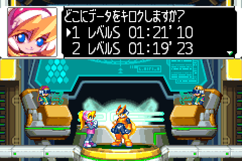

# SRAM

## Savedata slot



```
0xE00_0000 + (0xAAA * 0): game savedata1
0xE00_0000 + (0xAAA * 1): game savedata2
0xE00_0000 + (0xAAA * 2): game savedata3
0xE00_0000 + (0xAAA * 3): game savedata4
0xE00_0000 + (0xAAA * 4): game savedata5
0xE00_0000 + (0xAAA * 5): minigame savedata
```

### Backup

Each savedata has backup, and if the above data is corrupted, this is used.

```
0xE00_3FFC + (0xAAA * 0): game savedata1 backup
0xE00_3FFC + (0xAAA * 1): game savedata2 backup
0xE00_3FFC + (0xAAA * 2): game savedata3 backup
0xE00_3FFC + (0xAAA * 3): game savedata4 backup
0xE00_3FFC + (0xAAA * 4): game savedata5 backup
0xE00_3FFC + (0xAAA * 5): minigame savedata backup
```
